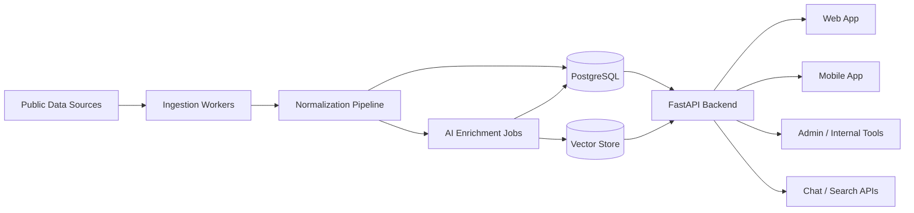
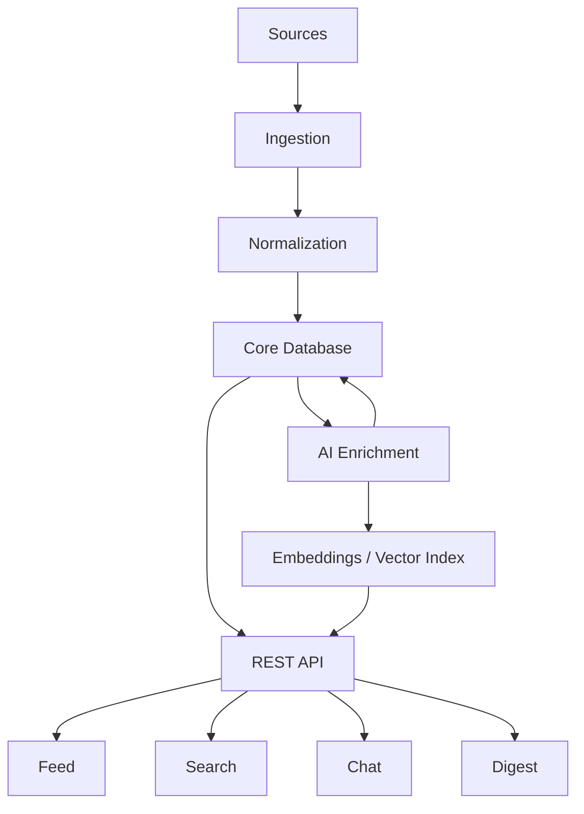

# Architecture: Startup / Market Intelligence Assistant

Tài liệu này mô tả kiến trúc tổng thể cho sản phẩm Startup / Market Intelligence Assistant theo hướng app + backend + AI.

Mục tiêu của kiến trúc này là:
- hỗ trợ phát triển MVP nhanh nhưng không phá cấu trúc về sau
- tách rõ ingestion, backend API, AI pipeline và ứng dụng client
- tối ưu cho dữ liệu công khai, summary, search, chat và digest
- giảm rủi ro bản quyền bằng cách tập trung vào signal, metadata và insight

## 1. Tầm nhìn kiến trúc

Sản phẩm nên được xây như một hệ thống gồm 5 lớp chính:

1. Data ingestion layer
2. Data processing and normalization layer
3. AI enrichment and retrieval layer
4. Backend API layer
5. Client application layer

Điểm quan trọng là sản phẩm không vận hành như một app đọc báo, mà như một hệ thống intelligence:
- thu thập tín hiệu
- chuẩn hóa dữ liệu
- enrich bằng AI
- phục vụ search, chat, digest và feed cá nhân hóa

## 2. Sơ đồ tổng thể



## 3. Các thành phần chính

## 3.1. Data Sources

Đây là lớp nguồn dữ liệu đầu vào.

Nguồn nên ưu tiên:
- company blog
- official newsroom
- press release
- Product Hunt
- GitHub releases
- changelog
- docs update pages
- RSS chính thức
- accelerator / incubator announcement pages

Nguyên tắc của lớp này:
- ưu tiên nguồn public chính thức
- không crawl nguồn paywall hoặc nguồn cần login
- không lưu lại full article nếu không có quyền rõ ràng

## 3.2. Ingestion Workers

Đây là lớp chịu trách nhiệm lấy dữ liệu từ nguồn ngoài.

Trách nhiệm:
- fetch dữ liệu theo lịch
- parse dữ liệu theo từng nguồn
- retry khi lỗi mạng hoặc nguồn tạm thời unavailable
- ghi log crawl thành công/thất bại
- đẩy dữ liệu raw vào bước normalize

Thành phần đề xuất:
- source fetcher
- source parser
- scheduler
- retry handler
- crawl logger

Ở giai đoạn hiện tại, repo của bạn đã có phần đầu của lớp này dưới dạng crawler scheduler. Về lâu dài nên tách rõ hơn thành các worker theo source.

## 3.3. Normalization Pipeline

Đây là lớp quan trọng nhất để biến dữ liệu thô thành signal chuẩn.

Trách nhiệm:
- chuẩn hóa cấu trúc dữ liệu
- chuẩn hóa thời gian, nguồn, URL
- map dữ liệu về mô hình `signal/event`
- deduplicate theo URL, title similarity, company + event_type
- lưu raw input để debug

Input ví dụ:
- bài viết hoặc announcement thô từ nguồn gốc

Output chuẩn nên có:
- source_name
- source_url
- title
- published_at
- raw_excerpt
- company_name
- event_type
- topic
- crawl_time
- normalized_payload

## 3.4. AI Enrichment Layer

Đây là lớp tạo giá trị AI cho sản phẩm.

Trách nhiệm:
- sinh `summary_one_line`
- sinh `summary_bullets`
- sinh `why_it_matters`
- gắn `topic`
- gắn `event_type`
- trích xuất `company_name`
- sinh `tags`
- tính `importance_score`
- chuẩn bị embedding cho retrieval

Nên triển khai theo job bất đồng bộ, không nằm trực tiếp trong request API.

Lớp này nên gồm:
- prompt builder
- LLM client
- structured output validator
- enrichment job runner
- failure/retry queue

## 3.5. Storage Layer

Kiến trúc lưu trữ nên chia ít nhất thành 2 loại:

### 1. Transactional database

Khuyến nghị: PostgreSQL

Lưu:
- sources
- raw_items
- signals
- companies
- topics
- digests
- users
- bookmarks
- chat_sessions
- chat_messages
- ai_enrichments

### 2. Vector storage

Khuyến nghị ngắn hạn:
- pgvector trong PostgreSQL nếu muốn hệ thống gọn

Khuyến nghị dài hạn:
- vector DB riêng khi số lượng document tăng lớn

Lưu:
- embeddings cho title
- embeddings cho summary
- embeddings cho signal content

## 3.6. Backend API Layer

Đây là lớp giao tiếp chính với app/web/mobile.

Khuyến nghị dùng FastAPI tiếp tục cho backend chính.

Nhóm API nên có:

### Public / client APIs

- `GET /health`
- `GET /api/v1/signals`
- `GET /api/v1/signals/{id}`
- `GET /api/v1/search`
- `GET /api/v1/topics`
- `GET /api/v1/companies`
- `GET /api/v1/trending`
- `GET /api/v1/digest/today`
- `POST /api/v1/chat`

### User APIs

- `POST /api/v1/auth/login`
- `GET /api/v1/me`
- `POST /api/v1/bookmarks`
- `GET /api/v1/bookmarks`
- `POST /api/v1/preferences`
- `GET /api/v1/watchlist`

### Internal / admin APIs

- `GET /api/internal/jobs`
- `GET /api/internal/sources`
- `POST /api/internal/reingest/{id}`
- `POST /api/internal/re-enrich/{id}`

## 3.7. Search and Retrieval Layer

Đây là lớp phục vụ search và chat RAG.

Bao gồm:
- keyword search
- structured filter search
- embedding-based semantic retrieval
- reranking

Luồng cơ bản:
1. user query
2. phân tích query
3. chọn retrieval mode
4. lấy signals liên quan
5. rerank
6. trả kết quả search hoặc build context cho chat

## 3.8. Chat / RAG Layer

Đây là lớp biến sản phẩm thành assistant thật sự.

Luồng chat đề xuất:
1. nhận câu hỏi người dùng
2. chuẩn hóa query
3. truy xuất signals liên quan
4. build context ngắn gọn
5. gọi model để sinh câu trả lời grounded
6. trả về answer + sources + metadata

Yêu cầu bắt buộc:
- câu trả lời luôn có nguồn tham chiếu
- có guardrail để tránh bịa thông tin ngoài dữ liệu retrieval
- có fallback khi không tìm thấy context đủ tốt

## 3.9. Client Application Layer

Lớp client gồm web app và mobile app.

Màn hình MVP nên có:
- feed
- signal detail
- search
- company page
- chat
- daily digest

Trải nghiệm UI cần xoay quanh signal thay vì article:
- title
- company
- event type
- topic
- AI summary
- why it matters
- source link

## 3.10. Observability and Evaluation Layer

Đây là lớp thường bị bỏ qua nhưng rất quan trọng nếu muốn đi theo AI Solution Engineer.

Phải theo dõi được:
- số lượng signal ingest mỗi ngày
- tỉ lệ parse thành công
- latency API
- latency enrichment jobs
- latency chat
- token usage
- AI cost
- failure rate
- tỉ lệ chat có source phù hợp
- feedback của người dùng với summary/chat

## 4. Kiến trúc logic theo lớp



## 5. Data Model mức khái niệm

Các entity chính nên có:

### `sources`
- id
- name
- type
- base_url
- risk_level
- is_active

### `raw_items`
- id
- source_id
- external_id
- raw_payload
- fetched_at
- parse_status

### `signals`
- id
- source_id
- source_url
- title
- raw_excerpt
- published_at
- company_id
- topic_id
- event_type
- crawl_time
- dedup_key
- status

### `signal_ai_enrichments`
- id
- signal_id
- summary_one_line
- summary_bullets
- why_it_matters
- tags
- importance_score
- confidence_score
- model_name
- prompt_version
- created_at

### `companies`
- id
- name
- normalized_name
- website
- category

### `topics`
- id
- name
- description

### `digests`
- id
- user_id
- digest_date
- content
- topics

### `users`
- id
- email
- role
- created_at

### `bookmarks`
- id
- user_id
- signal_id
- created_at

### `chat_sessions`
- id
- user_id
- created_at

### `chat_messages`
- id
- session_id
- role
- content
- sources
- created_at

## 6. Luồng dữ liệu end-to-end

## 6.1. Ingestion Flow

1. Scheduler kích hoạt source worker
2. Worker fetch dữ liệu từ nguồn
3. Parser tách dữ liệu cần thiết
4. Raw item được lưu lại
5. Normalizer biến thành signal chuẩn
6. Dedupe check
7. Signal hợp lệ được lưu DB
8. AI enrichment job được tạo

## 6.2. Enrichment Flow

1. Worker lấy signal chưa enrich
2. Build prompt theo template
3. Gọi model
4. Validate output JSON
5. Lưu summary, tags, event type, importance score
6. Tạo embedding
7. Cập nhật vector index

## 6.3. Search Flow

1. User gọi search API
2. Backend phân tích query
3. Chạy keyword filter hoặc semantic retrieval
4. Rerank kết quả
5. Trả kết quả có summary và source link

## 6.4. Chat Flow

1. User gửi câu hỏi
2. Backend gọi retrieval layer
3. Lấy context liên quan
4. Build grounded prompt
5. Model sinh câu trả lời
6. Trả `answer`, `sources`, `meta`

## 6.5. Digest Flow

1. Scheduler chạy theo ngày
2. Chọn top signals theo topic / preference
3. Sinh digest summary
4. Lưu digest
5. App/web hiển thị hoặc gửi notification

## 7. Kiến trúc module đề xuất cho repo

Repo hiện tại đang có nền FastAPI + crawler. Để mở rộng đúng hướng, nên tiến hóa thành cấu trúc gần như sau:

```text
app/
  main.py
  api/
    routers/
      health.py
      signals.py
      search.py
      chat.py
      users.py
      digests.py
  core/
    config.py
    logging.py
    security.py
  ingestion/
    sources/
    parsers/
    workers/
    scheduler.py
  normalization/
    normalizer.py
    dedupe.py
  ai/
    prompts/
    enrichers/
    embeddings/
    retrieval/
    chat/
  services/
    signal_service.py
    search_service.py
    chat_service.py
    digest_service.py
  database/
    db.py
    models.py
    repositories/
  schemas/
    signal.py
    search.py
    chat.py
    digest.py
```

## 8. Kiến trúc triển khai theo giai đoạn

## Giai đoạn 1: Monolith có kỷ luật

Khuyến nghị cho MVP:
- 1 backend FastAPI
- 1 PostgreSQL
- 1 scheduler / background job runner
- 1 vector store tích hợp cùng PostgreSQL nếu cần

Lý do:
- đơn giản để build nhanh
- ít overhead vận hành
- phù hợp quy mô nhỏ đến vừa

## Giai đoạn 2: Tách worker khỏi API

Khi ingestion và AI jobs tăng tải:
- tách ingestion workers riêng
- tách AI enrichment workers riêng
- giữ API service chỉ phục vụ request của client

## Giai đoạn 3: Tách retrieval / chat khi cần scale

Khi search/chat có lưu lượng lớn:
- tách retrieval service
- tách chat orchestration service
- cân nhắc vector database riêng

## 9. Bảo mật và chính sách

Kiến trúc cần hỗ trợ các ràng buộc sau:
- không lưu trữ nội dung full article khi không có quyền
- chỉ expose excerpt ngắn + AI summary + source link
- ghi nhận nguồn gốc dữ liệu rõ ràng
- lưu prompt version và model name để audit AI output
- phân quyền giữa public APIs, user APIs và internal APIs

## 10. KPI kỹ thuật nên theo dõi

- ingestion success rate
- dedup rate
- signal creation rate
- enrichment success rate
- enrichment latency
- search latency
- chat latency
- token usage per enrichment job
- token usage per chat session
- cost per day
- API error rate

## 11. Quyết định kiến trúc nên chốt sớm

1. Hệ thống sẽ lấy dữ liệu theo mô hình `signal/event`, không theo `full article`.
2. AI enrichment chạy bất đồng bộ, không gắn trực tiếp vào request client.
3. Search và chat sẽ dùng retrieval trên signal đã chuẩn hóa.
4. PostgreSQL là nguồn sự thật chính ở giai đoạn đầu.
5. API giữ vai trò orchestration layer cho app/web/mobile.
6. Toàn bộ output AI cần có khả năng audit qua model name, prompt version, timestamp.

## 12. Thứ tự build khuyến nghị theo kiến trúc này

1. Chuẩn hóa schema `signals`
2. Tách ingestion và normalization rõ ràng
3. Hoàn thiện signal APIs
4. Thêm AI enrichment pipeline
5. Thêm search + retrieval
6. Thêm chat RAG
7. Thêm digest
8. Thêm user system và personalization

## 13. Kết luận

Kiến trúc phù hợp nhất cho sản phẩm này là một backend monolith có kỷ luật, kết hợp ingestion pipeline, AI enrichment jobs, retrieval layer và REST API phục vụ app/web/mobile.

Điểm cốt lõi của kiến trúc là:
- xây quanh signal
- enrich bằng AI
- phục vụ insight thay vì chỉ hiển thị tin
- mở rộng dần từ MVP sang platform có search, chat, digest và personalization