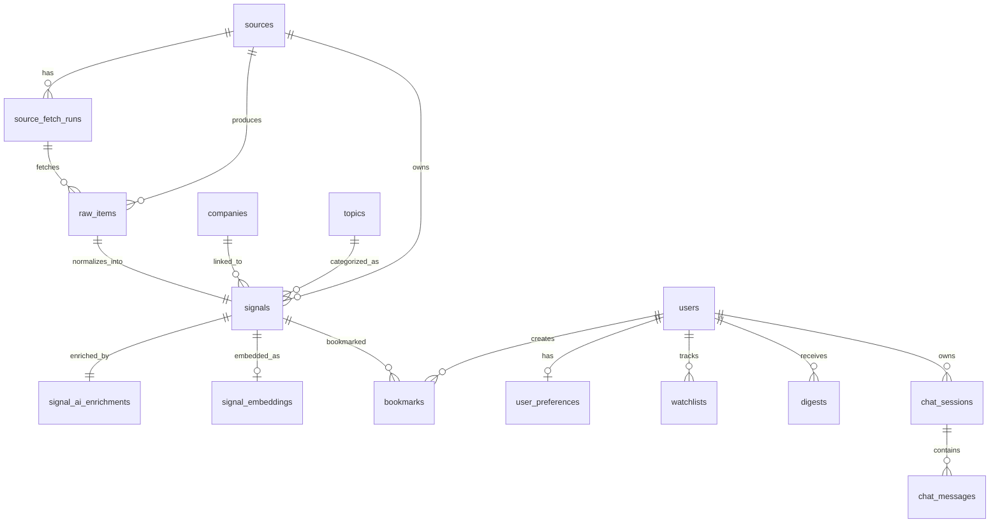

# Database Schema V2 Design

Tài liệu này mô tả thiết kế schema DB v2 cho sản phẩm Startup / Market Intelligence Assistant.

Mục tiêu của schema v2:
- chuẩn hóa mô hình `source -> raw_item -> signal -> AI enrichment`
- hỗ trợ ingestion nhiều nguồn an toàn
- hỗ trợ normalize, dedup, search, chat và digest
- đủ gọn để triển khai MVP, nhưng không chặn đường mở rộng sau này

## 1. Mục tiêu thiết kế schema v2

Schema v2 cần giải quyết các bài toán sau:

1. Quản lý nhiều nguồn dữ liệu chính thức.
2. Lưu được dữ liệu raw để parse lại nếu cần.
3. Chuẩn hóa dữ liệu thành `signals`.
4. Lưu AI summary, topic, event type, tags, importance score.
5. Hỗ trợ search và chat grounded trên dữ liệu đã normalize.
6. Hỗ trợ watchlist, bookmark, digest trong giai đoạn sau.

## 2. Phạm vi schema v2

Schema v2 được chia thành 3 lớp:

### 3.1. Core MVP tables

- `sources`
- `source_fetch_runs`
- `raw_items`
- `companies`
- `topics`
- `signals`
- `signal_ai_enrichments`

### 3.2. Search / AI support tables

- `signal_embeddings`

### 3.3. User and product tables

- `users`
- `bookmarks`
- `watchlists`
- `user_preferences`
- `digests`
- `chat_sessions`
- `chat_messages`

Khuyến nghị triển khai theo thứ tự:
1. Core MVP tables
2. Search / AI support tables
3. User and product tables

## 3. Quy tắc thiết kế

1. PostgreSQL là source of truth chính.
2. Dùng `BIGSERIAL` hoặc `BIGINT` cho khóa chính để dễ mở rộng.
3. Dùng `TIMESTAMPTZ` cho mọi trường thời gian.
4. Dùng `JSONB` cho raw payload và structured output linh hoạt.
5. Không dùng PostgreSQL enum ở giai đoạn đầu nếu chưa ổn định taxonomy.
6. Ưu tiên `TEXT + CHECK` hoặc bảng taxonomy khi cần mở rộng dần.

## 4. Thiết kế bảng chi tiết

## 5.1. `sources`

Mục đích:
- quản lý nguồn dữ liệu được phép ingest
- lưu metadata về risk level và cách ingest

| Cột | Kiểu dữ liệu | Ràng buộc | Ý nghĩa |
| --- | --- | --- | --- |
| `id` | `BIGSERIAL` | PK | ID nguồn |
| `name` | `TEXT` | NOT NULL, UNIQUE | Tên nguồn |
| `source_type` | `TEXT` | NOT NULL | company_blog / newsroom / changelog / ecosystem / aggregator |
| `base_url` | `TEXT` | NOT NULL | URL gốc |
| `ingest_method` | `TEXT` | NOT NULL | api / rss / html |
| `risk_level` | `TEXT` | NOT NULL | A / B / C |
| `terms_reviewed` | `BOOLEAN` | NOT NULL DEFAULT FALSE | Đã review ToS chưa |
| `robots_reviewed` | `BOOLEAN` | NOT NULL DEFAULT FALSE | Đã review robots.txt chưa |
| `auth_required` | `BOOLEAN` | NOT NULL DEFAULT FALSE | Có cần login không |
| `paywall` | `BOOLEAN` | NOT NULL DEFAULT FALSE | Có paywall không |
| `store_full_text` | `BOOLEAN` | NOT NULL DEFAULT FALSE | Có được lưu full text không |
| `status` | `TEXT` | NOT NULL DEFAULT 'active' | active / paused / blocked |
| `owner` | `TEXT` | NULL | Người phụ trách review |
| `created_at` | `TIMESTAMPTZ` | NOT NULL DEFAULT now() | Thời điểm tạo |
| `updated_at` | `TIMESTAMPTZ` | NOT NULL DEFAULT now() | Thời điểm cập nhật |

Index đề xuất:
- unique index trên `name`
- index trên `status`
- index trên `risk_level`

## 5.2. `source_fetch_runs`

Mục đích:
- lưu lịch sử chạy fetch của từng nguồn
- phục vụ logging, monitoring, retry và debugging

| Cột | Kiểu dữ liệu | Ràng buộc | Ý nghĩa |
| --- | --- | --- | --- |
| `id` | `BIGSERIAL` | PK | ID lần chạy |
| `source_id` | `BIGINT` | FK -> `sources.id`, NOT NULL | Nguồn được fetch |
| `status` | `TEXT` | NOT NULL | running / success / failed |
| `started_at` | `TIMESTAMPTZ` | NOT NULL DEFAULT now() | Thời điểm bắt đầu |
| `finished_at` | `TIMESTAMPTZ` | NULL | Thời điểm kết thúc |
| `items_fetched` | `INTEGER` | NOT NULL DEFAULT 0 | Số raw item lấy được |
| `items_created` | `INTEGER` | NOT NULL DEFAULT 0 | Số signal tạo được |
| `error_message` | `TEXT` | NULL | Lỗi nếu có |
| `metadata` | `JSONB` | NOT NULL DEFAULT '{}'::jsonb | Metadata bổ sung |

Index đề xuất:
- index trên `source_id`
- index trên `started_at DESC`
- index trên `status`

## 5.3. `raw_items`

Mục đích:
- lưu dữ liệu raw từ nguồn ngoài trước khi normalize
- cho phép re-parse hoặc debug sau này

| Cột | Kiểu dữ liệu | Ràng buộc | Ý nghĩa |
| --- | --- | --- | --- |
| `id` | `BIGSERIAL` | PK | ID raw item |
| `source_id` | `BIGINT` | FK -> `sources.id`, NOT NULL | Nguồn gốc |
| `fetch_run_id` | `BIGINT` | FK -> `source_fetch_runs.id`, NULL | Lần fetch tạo raw item |
| `external_id` | `TEXT` | NULL | ID bên ngoài nếu nguồn có |
| `source_url` | `TEXT` | NOT NULL | URL gốc của item |
| `title` | `TEXT` | NULL | Title raw |
| `published_at` | `TIMESTAMPTZ` | NULL | Published time raw |
| `raw_payload` | `JSONB` | NOT NULL | Payload đầy đủ dạng raw |
| `parse_status` | `TEXT` | NOT NULL DEFAULT 'pending' | pending / parsed / failed |
| `parse_error` | `TEXT` | NULL | Lỗi parse nếu có |
| `fetched_at` | `TIMESTAMPTZ` | NOT NULL DEFAULT now() | Thời điểm fetch |
| `created_at` | `TIMESTAMPTZ` | NOT NULL DEFAULT now() | Thời điểm tạo |

Ràng buộc đề xuất:
- unique partial trên (`source_id`, `external_id`) nếu `external_id IS NOT NULL`
- unique trên (`source_id`, `source_url`)

Index đề xuất:
- index trên `source_id`
- index trên `parse_status`
- index trên `published_at DESC`

## 5.4. `companies`

Mục đích:
- chuẩn hóa công ty / startup / tổ chức xuất hiện trong signals

| Cột | Kiểu dữ liệu | Ràng buộc | Ý nghĩa |
| --- | --- | --- | --- |
| `id` | `BIGSERIAL` | PK | ID công ty |
| `name` | `TEXT` | NOT NULL | Tên hiển thị |
| `normalized_name` | `TEXT` | NOT NULL, UNIQUE | Tên chuẩn hóa để dedup |
| `website` | `TEXT` | NULL | Website công ty |
| `domain` | `TEXT` | NULL | Domain chính |
| `company_type` | `TEXT` | NULL | startup / public_company / vc / accelerator / other |
| `country_code` | `TEXT` | NULL | Mã quốc gia |
| `created_at` | `TIMESTAMPTZ` | NOT NULL DEFAULT now() | Thời điểm tạo |
| `updated_at` | `TIMESTAMPTZ` | NOT NULL DEFAULT now() | Thời điểm cập nhật |

Index đề xuất:
- unique index trên `normalized_name`
- index trên `domain`

## 5.5. `topics`

Mục đích:
- chuẩn hóa topic để phục vụ filter, search, digest

| Cột | Kiểu dữ liệu | Ràng buộc | Ý nghĩa |
| --- | --- | --- | --- |
| `id` | `BIGSERIAL` | PK | ID topic |
| `name` | `TEXT` | NOT NULL, UNIQUE | Tên topic |
| `slug` | `TEXT` | NOT NULL, UNIQUE | Slug chuẩn hóa |
| `description` | `TEXT` | NULL | Mô tả ngắn |
| `created_at` | `TIMESTAMPTZ` | NOT NULL DEFAULT now() | Thời điểm tạo |

Index đề xuất:
- unique index trên `slug`

## 5.6. `signals`

Mục đích:
- bảng trung tâm của schema v2
- lưu dữ liệu đã normalize và phục vụ API/feed/search/chat

| Cột | Kiểu dữ liệu | Ràng buộc | Ý nghĩa |
| --- | --- | --- | --- |
| `id` | `BIGSERIAL` | PK | ID signal |
| `source_id` | `BIGINT` | FK -> `sources.id`, NOT NULL | Nguồn gốc |
| `raw_item_id` | `BIGINT` | FK -> `raw_items.id`, UNIQUE, NOT NULL | Raw item tạo ra signal |
| `source_url` | `TEXT` | NOT NULL | URL nguồn gốc |
| `title` | `TEXT` | NOT NULL | Tiêu đề |
| `raw_excerpt` | `TEXT` | NULL | Excerpt ngắn từ nguồn |
| `author_name` | `TEXT` | NULL | Tác giả nếu có |
| `image_url` | `TEXT` | NULL | Ảnh đại diện nếu được phép dùng |
| `published_at` | `TIMESTAMPTZ` | NULL | Thời điểm nguồn publish |
| `crawl_time` | `TIMESTAMPTZ` | NOT NULL DEFAULT now() | Thời điểm hệ thống ingest |
| `company_id` | `BIGINT` | FK -> `companies.id`, NULL | Công ty chính được gắn |
| `primary_topic_id` | `BIGINT` | FK -> `topics.id`, NULL | Topic chính |
| `event_type` | `TEXT` | NOT NULL DEFAULT 'market_move' | funding / product_launch / hiring / partnership / acquisition / market_move / regulation / competitor_update |
| `dedup_key` | `TEXT` | NOT NULL, UNIQUE | Khóa dedup logic |
| `signal_status` | `TEXT` | NOT NULL DEFAULT 'active' | active / hidden / rejected |
| `visibility` | `TEXT` | NOT NULL DEFAULT 'public' | public / internal |
| `created_at` | `TIMESTAMPTZ` | NOT NULL DEFAULT now() | Thời điểm tạo |
| `updated_at` | `TIMESTAMPTZ` | NOT NULL DEFAULT now() | Thời điểm cập nhật |

Ràng buộc gợi ý:
- `CHECK (event_type IN ('funding','product_launch','hiring','partnership','acquisition','market_move','regulation','competitor_update'))`

Index đề xuất:
- unique index trên `dedup_key`
- index trên `published_at DESC`
- index trên `company_id`
- index trên `primary_topic_id`
- index trên `event_type`
- index trên `source_id`
- composite index trên (`published_at DESC`, `event_type`)

## 5.7. `signal_ai_enrichments`

Mục đích:
- lưu lớp insight do AI sinh ra cho mỗi signal

Thiết kế MVP khuyến nghị:
- 1 row enrichment hiện hành cho mỗi signal
- lưu `model_name` và `prompt_version` để audit

| Cột | Kiểu dữ liệu | Ràng buộc | Ý nghĩa |
| --- | --- | --- | --- |
| `id` | `BIGSERIAL` | PK | ID enrichment |
| `signal_id` | `BIGINT` | FK -> `signals.id`, UNIQUE, NOT NULL | Signal được enrich |
| `summary_one_line` | `TEXT` | NULL | Tóm tắt 1 câu |
| `summary_bullets` | `JSONB` | NOT NULL DEFAULT '[]'::jsonb | Danh sách bullet points |
| `why_it_matters` | `TEXT` | NULL | Vì sao quan trọng |
| `tags` | `TEXT[]` | NOT NULL DEFAULT '{}' | Tags ngắn |
| `importance_score` | `SMALLINT` | NULL | Điểm 1-5 |
| `confidence_score` | `NUMERIC(5,4)` | NULL | Độ tự tin 0-1 |
| `company_name_extracted` | `TEXT` | NULL | Tên company do AI trích xuất |
| `topic_extracted` | `TEXT` | NULL | Topic do AI gợi ý |
| `event_type_extracted` | `TEXT` | NULL | Event type do AI gợi ý |
| `model_name` | `TEXT` | NOT NULL | Model dùng để enrich |
| `prompt_version` | `TEXT` | NOT NULL | Version prompt |
| `enrichment_status` | `TEXT` | NOT NULL DEFAULT 'done' | pending / done / failed |
| `error_message` | `TEXT` | NULL | Lỗi nếu có |
| `created_at` | `TIMESTAMPTZ` | NOT NULL DEFAULT now() | Thời điểm tạo |
| `updated_at` | `TIMESTAMPTZ` | NOT NULL DEFAULT now() | Thời điểm cập nhật |

Index đề xuất:
- unique index trên `signal_id`
- index trên `importance_score DESC`
- GIN index trên `tags`

Gợi ý nâng cấp về sau:
- nếu cần version nhiều lần enrichment cho cùng signal, chuyển unique `signal_id` thành versioned rows + `is_latest`

## 5.8. `signal_embeddings`

Mục đích:
- phục vụ semantic search và RAG

Thiết kế MVP:
- 1 row embedding hiện hành cho mỗi signal

| Cột | Kiểu dữ liệu | Ràng buộc | Ý nghĩa |
| --- | --- | --- | --- |
| `id` | `BIGSERIAL` | PK | ID embedding |
| `signal_id` | `BIGINT` | FK -> `signals.id`, UNIQUE, NOT NULL | Signal tương ứng |
| `embedding_text` | `TEXT` | NOT NULL | Nội dung đã concat để embed |
| `embedding_model` | `TEXT` | NOT NULL | Tên model embedding |
| `embedding` | `JSONB` hoặc `VECTOR` | NOT NULL | Giá trị embedding |
| `created_at` | `TIMESTAMPTZ` | NOT NULL DEFAULT now() | Thời điểm tạo |

Khuyến nghị:
- nếu dùng `pgvector`, đổi `embedding` sang kiểu `vector(n)`
- nếu chưa dùng `pgvector` ngay, có thể tạm để JSONB trong giai đoạn thiết kế và chuyển sau

## 5.9. `users`

| Cột | Kiểu dữ liệu | Ràng buộc | Ý nghĩa |
| --- | --- | --- | --- |
| `id` | `BIGSERIAL` | PK | ID user |
| `email` | `TEXT` | NOT NULL, UNIQUE | Email đăng nhập |
| `password_hash` | `TEXT` | NULL | Hash mật khẩu nếu dùng local auth |
| `role` | `TEXT` | NOT NULL DEFAULT 'user' | user / admin |
| `status` | `TEXT` | NOT NULL DEFAULT 'active' | active / disabled |
| `created_at` | `TIMESTAMPTZ` | NOT NULL DEFAULT now() | Thời điểm tạo |

## 5.10. `bookmarks`

| Cột | Kiểu dữ liệu | Ràng buộc | Ý nghĩa |
| --- | --- | --- | --- |
| `id` | `BIGSERIAL` | PK | ID bookmark |
| `user_id` | `BIGINT` | FK -> `users.id`, NOT NULL | User |
| `signal_id` | `BIGINT` | FK -> `signals.id`, NOT NULL | Signal |
| `created_at` | `TIMESTAMPTZ` | NOT NULL DEFAULT now() | Thời điểm bookmark |

Ràng buộc:
- unique trên (`user_id`, `signal_id`)

## 5.11. `user_preferences`

| Cột | Kiểu dữ liệu | Ràng buộc | Ý nghĩa |
| --- | --- | --- | --- |
| `id` | `BIGSERIAL` | PK | ID preference |
| `user_id` | `BIGINT` | FK -> `users.id`, UNIQUE, NOT NULL | User |
| `preferred_topics` | `TEXT[]` | NOT NULL DEFAULT '{}' | Topic ưu tiên |
| `preferred_event_types` | `TEXT[]` | NOT NULL DEFAULT '{}' | Event type ưu tiên |
| `preferred_companies` | `TEXT[]` | NOT NULL DEFAULT '{}' | Company ưu tiên |
| `digest_enabled` | `BOOLEAN` | NOT NULL DEFAULT TRUE | Có nhận digest không |
| `updated_at` | `TIMESTAMPTZ` | NOT NULL DEFAULT now() | Thời điểm cập nhật |

## 5.12. `watchlists`

| Cột | Kiểu dữ liệu | Ràng buộc | Ý nghĩa |
| --- | --- | --- | --- |
| `id` | `BIGSERIAL` | PK | ID watchlist item |
| `user_id` | `BIGINT` | FK -> `users.id`, NOT NULL | User |
| `watch_type` | `TEXT` | NOT NULL | company / topic / event_type |
| `watch_value` | `TEXT` | NOT NULL | Giá trị đang theo dõi |
| `created_at` | `TIMESTAMPTZ` | NOT NULL DEFAULT now() | Thời điểm tạo |

Ràng buộc:
- unique trên (`user_id`, `watch_type`, `watch_value`)

## 5.13. `digests`

| Cột | Kiểu dữ liệu | Ràng buộc | Ý nghĩa |
| --- | --- | --- | --- |
| `id` | `BIGSERIAL` | PK | ID digest |
| `user_id` | `BIGINT` | FK -> `users.id`, NULL | User cụ thể nếu cá nhân hóa |
| `digest_date` | `DATE` | NOT NULL | Ngày digest |
| `digest_type` | `TEXT` | NOT NULL DEFAULT 'daily' | daily / weekly |
| `title` | `TEXT` | NOT NULL | Tiêu đề digest |
| `content` | `JSONB` | NOT NULL | Nội dung digest dạng structured |
| `created_at` | `TIMESTAMPTZ` | NOT NULL DEFAULT now() | Thời điểm tạo |

Index đề xuất:
- index trên (`user_id`, `digest_date DESC`)

## 5.14. `chat_sessions`

| Cột | Kiểu dữ liệu | Ràng buộc | Ý nghĩa |
| --- | --- | --- | --- |
| `id` | `BIGSERIAL` | PK | ID session |
| `user_id` | `BIGINT` | FK -> `users.id`, NULL | User |
| `title` | `TEXT` | NULL | Tên conversation |
| `created_at` | `TIMESTAMPTZ` | NOT NULL DEFAULT now() | Tạo lúc nào |
| `updated_at` | `TIMESTAMPTZ` | NOT NULL DEFAULT now() | Cập nhật cuối |

## 5.15. `chat_messages`

| Cột | Kiểu dữ liệu | Ràng buộc | Ý nghĩa |
| --- | --- | --- | --- |
| `id` | `BIGSERIAL` | PK | ID message |
| `session_id` | `BIGINT` | FK -> `chat_sessions.id`, NOT NULL | Session |
| `role` | `TEXT` | NOT NULL | user / assistant / system |
| `content` | `TEXT` | NOT NULL | Nội dung message |
| `sources` | `JSONB` | NOT NULL DEFAULT '[]'::jsonb | Danh sách source/signal được trích dẫn |
| `model_name` | `TEXT` | NULL | Model dùng để trả lời |
| `created_at` | `TIMESTAMPTZ` | NOT NULL DEFAULT now() | Thời điểm tạo |

Index đề xuất:
- index trên `session_id`
- index trên `created_at`

## 6. Quan hệ chính giữa các bảng



## 5. Khởi tạo dữ liệu ban đầu

Gợi ý bootstrap cho môi trường mới:
1. tạo `source registry` với các nguồn A-risk đã review
2. chạy ingestion theo lô nhỏ để kiểm tra normalize + dedupe
3. bật enrichment baseline cho signals mới
4. theo dõi chất lượng parse trước khi mở rộng thêm nguồn

## 6. DDL mẫu cho core tables

Ví dụ DDL PostgreSQL cho bảng `sources`:

```sql
CREATE TABLE sources (
    id BIGSERIAL PRIMARY KEY,
    name TEXT NOT NULL UNIQUE,
    source_type TEXT NOT NULL,
    base_url TEXT NOT NULL,
    ingest_method TEXT NOT NULL,
    risk_level TEXT NOT NULL,
    terms_reviewed BOOLEAN NOT NULL DEFAULT FALSE,
    robots_reviewed BOOLEAN NOT NULL DEFAULT FALSE,
    auth_required BOOLEAN NOT NULL DEFAULT FALSE,
    paywall BOOLEAN NOT NULL DEFAULT FALSE,
    store_full_text BOOLEAN NOT NULL DEFAULT FALSE,
    status TEXT NOT NULL DEFAULT 'active',
    owner TEXT,
    created_at TIMESTAMPTZ NOT NULL DEFAULT now(),
    updated_at TIMESTAMPTZ NOT NULL DEFAULT now()
);
```

Ví dụ DDL PostgreSQL cho bảng `signals`:

```sql
CREATE TABLE signals (
    id BIGSERIAL PRIMARY KEY,
    source_id BIGINT NOT NULL REFERENCES sources(id),
    raw_item_id BIGINT NOT NULL UNIQUE REFERENCES raw_items(id),
    source_url TEXT NOT NULL,
    title TEXT NOT NULL,
    raw_excerpt TEXT,
    author_name TEXT,
    image_url TEXT,
    published_at TIMESTAMPTZ,
    crawl_time TIMESTAMPTZ NOT NULL DEFAULT now(),
    company_id BIGINT REFERENCES companies(id),
    primary_topic_id BIGINT REFERENCES topics(id),
    event_type TEXT NOT NULL DEFAULT 'market_move',
    dedup_key TEXT NOT NULL UNIQUE,
    signal_status TEXT NOT NULL DEFAULT 'active',
    visibility TEXT NOT NULL DEFAULT 'public',
    created_at TIMESTAMPTZ NOT NULL DEFAULT now(),
    updated_at TIMESTAMPTZ NOT NULL DEFAULT now(),
    CHECK (
        event_type IN (
            'funding',
            'product_launch',
            'hiring',
            'partnership',
            'acquisition',
            'market_move',
            'regulation',
            'competitor_update'
        )
    )
);
```

## 7. Thứ tự triển khai khuyến nghị

### Giai đoạn 1

Triển khai ngay:
- `sources`
- `source_fetch_runs`
- `raw_items`
- `companies`
- `topics`
- `signals`
- `signal_ai_enrichments`

### Giai đoạn 2

Triển khai tiếp:
- `signal_embeddings`
- search/retrieval integration

### Giai đoạn 3

Triển khai sau khi có app/user flow:
- `users`
- `bookmarks`
- `user_preferences`
- `watchlists`
- `digests`
- `chat_sessions`
- `chat_messages`

## 8. Kết luận

Schema DB v2 nên lấy `signals` làm bảng trung tâm, nhưng phải có đầy đủ lớp bao quanh:
- `sources` để quản lý nguồn
- `raw_items` để lưu dữ liệu gốc
- `signal_ai_enrichments` để lưu insight AI
- `signal_embeddings` để phục vụ retrieval
- các bảng user/product cho giai đoạn sau

Thiết kế này đủ thực dụng để bắt đầu implement ngay, đồng thời đủ đúng hướng để sau này mở rộng sang search, chat, digest và personalization mà không phải thiết kế lại từ đầu.